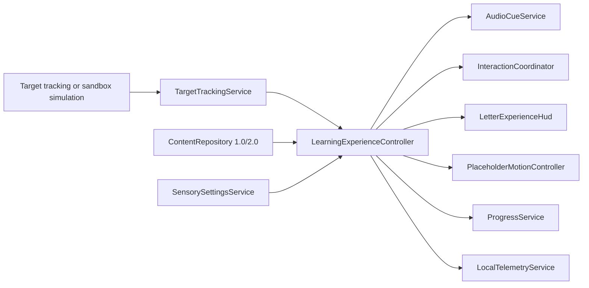

# Engagement architecture

## Intent

Sprint E1 adds a reusable, offline educational experience layer above the recovered tracking and content foundation. It does not alter Vuforia internals and does not claim clinical or therapeutic efficacy.

The architecture keeps five boundaries:

1. **Tracking input** — `TargetTrackingService` exposes technology-neutral found/lost events. The pilot Vuforia adapter only translates legacy callbacks.
2. **Content** — `LearningContentItem` remains JsonUtility-compatible and supports both schema 1.0 fallback items and schema 2.0 enriched items.
3. **Experience orchestration** — one cancellable state machine owns one active letter experience, one interaction and one narration.
4. **Presentation** — HUD, subtitles, step indicator, sensory settings, audio cues and placeholder motion are replaceable adapters.
5. **Local persistence** — progress, preferences and bounded telemetry remain on-device and contain no media, location, advertising identifiers or biometric data.

## Runtime flow

## Invariants

- `LearningExperienceController.ActiveInstance` admits at most one active controller.
- State transitions are serialized; target loss and exit cancel the active sequence and interaction.
- Sequence coroutines carry a generation token and are stopped on cancellation/destruction.
- Narration uses a single channel; SFX uses a separate channel; Ambient is disabled by default.
- Resources are cached after first load and are never loaded from `Update`.
- `Update` is limited to lightweight input polling in the tap adapter.
- No runtime `FindObjectOfType`, continuous instantiation or critical-loop LINQ is used.
- Missing optional media degrades to captions and deterministic timing without exceptions.

## A–Z scaling

All letters retain their existing IDs, target names and basic prefab resources. A schema-2 item may opt into the enriched controller through simple fields; incomplete B–Z items continue through a basic letter fallback. New letter experiences should add content configuration and assets without branching the core state machine.
